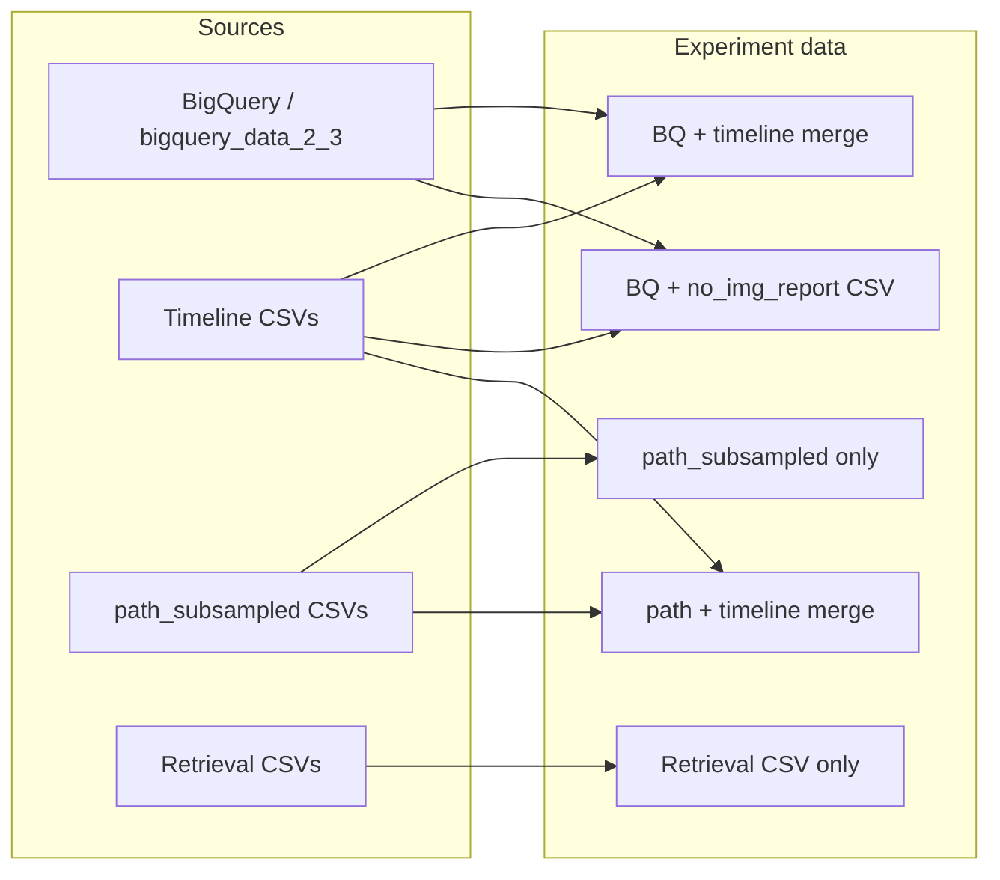

# Vista Bench data cohort

This document describes where task and cohort data come from (BigQuery, CSVs, parquet) and how they are organized for Vista Eval VLM.

## BigQuery

- **Project:** `som-nero-plevriti-deidbdf`
- **Dataset:** CURRENT VERSION OF VISTA BENCH `vista_bench_v1_3` (constant [VISTA_BENCH_DATASET](../src/data_tools/utils/query_utils.py) in `query_utils.py`).
- **Tables:** One table per source cohort; the table name is given by `task_source_csv` in the task registry (e.g. `progression_recurrence_survival_1yr_2yr_3yr_4yr_5yr`).
- **Task rows:** Fetched via [fetch_task_data_from_bq](../src/data_tools/utils/query_utils.py): `SELECT * FROM {project}.{dataset}.{table} WHERE task = @task_name`.

The orchestrator in [run_bq.py](../src/vista_run/run_bq.py) uses the same project and dataset when querying; table name comes from each task’s `task_source_csv` in the valid_tasks JSON.

## Local cache

BigQuery results can be cached as CSV files so the pipeline does not need to hit BQ every run:

- **Path:** `{base_dir}/bigquery_data_2_3/{source_csv}` specified in `all_tasks.yaml` — one CSV per source table (e.g. one file for the whole table; multiple tasks may share the same file and are filtered by `task` column).
- **Resolution:** [resolve_local_bq_cache_path](../src/data_tools/utils/task_data_utils.py) in `task_data_utils.py`.

If this path exists, [run_bq.py](../src/vista_run/run_bq.py) loads the task’s rows from the local CSV instead of querying BigQuery.

## Task registry

Defined under `paths` in [configs/all_tasks.yaml](../configs/all_tasks.yaml):

- **valid_tasks:** JSON file (e.g. `tasks/valid_tasks_v1_3.json`) listing tasks with `task_name` and `task_source_csv` (and optionally `is_binary`).
- **prompts:** JSON (e.g. `tasks/prompts_by_task.json`) — template per task, typically containing `[PATIENT_TIMELINE]`.
- **image_prompts:** JSON (e.g. `tasks/image_valid_tasks.json`) — used for image-only experiments (no_timeline, path, etc.).

Paths are resolved relative to `paths.base_dir`.

## Timeline and splits

Patient timeline text lives in **local CSVs**, not in BigQuery:

- **Naming:** [resolve_timeline_csv_path](../src/data_tools/utils/task_data_utils.py) and [resolve_timeline_csv_filename](../src/data_tools/utils/task_data_utils.py) — e.g. `{task_name}_subsampled.csv`, `{task_name}_subsampled_no_img_report.csv`, under `base_dir/{source_csv}/` or `base_dir/v1_2/{source_csv}/` or `base_dir/v1_3/{source_csv}/`.
- **Merge:** [merge_bq_with_timeline_csv](../src/data_tools/utils/task_data_utils.py) joins BQ data with the timeline CSV on `person_id`, attaching `patient_string` or `patient_timeline` (and optionally `report` for no_report/report experiments).
- **Subsampling:** Config key `subsample: true` selects `_subsampled*.csv` filenames; when false, non-subsampled filenames are used.

For experiments that need a timeline (e.g. no_image, report, timeline_only, path_full), the orchestrator loads BQ (or cache) and merges with the appropriate timeline CSV. For image-only or retrieval experiments it may load a different CSV or no timeline.

## Pathology tasks

Pathology-based experiments use the **v1_3** cohort:

- **Source tables/cache:** `bigquery_v1_3` (path to CSVs may differ from `bigquery_data_2_3` in some setups).
- **Subsampled path CSVs:** `v1_3/{source_csv}/{task_name}_path_subsampled.csv` — produced by [subsample_v1_3_path.py](../src/data_tools/csv_helper/subsample_v1_3_path.py). See [01-pathology-and-path-tools.md](01-pathology-and-path-tools.md).

## Full test parquet

For experiments **all_vb_timeline_only** and **all_vb_image_only**:

- **Data source:** `{task_name}_full.parquet` in `base_dir/{source_csv}/`.
- **Produced by:** [full_test_ehr_vb_download.py](../src/data_tools/full_dataset_utils/full_test_ehr_vb_download.py) — loads from BQ cache, filters `split=='test'`, adds `patient_string` via MEDS/ontology, writes parquet.
- **Columns:** Include `patient_string` (timeline) and for image-only, `nifti_path` and `_accession_number` for CT loading.

## Retrieval cohort

For **retrieval experiments** (e.g. retrieved_timeline, retrieved_timeline_per_iteration):

- **Data source:** `{task_name}_subsampled_retrieval.csv` under `base_dir/v1_2/{source_csv}/` ([resolve_retrieval_csv_path](../src/data_tools/utils/task_data_utils.py)).
- **No BQ merge:** The retrieval CSV is used directly; timeline content comes from the retrieval process, not from the timeline CSVs. Create these with `format_retrieval_csv.py` (or equivalent) before running retrieval experiments.

## Data flow (by experiment type)

Normal/report/timeline_only use BQ (or cache) merged with the appropriate timeline CSV. Path uses path_subsampled CSVs; path_full adds timeline merge. Retrieval experiments use the retrieval CSV only.
