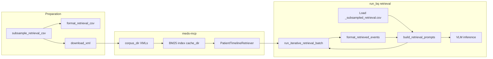

# Retrieval Pipeline:

This document describes the full retrieval pipeline in Vista Eval VLM: downloading patient XMLs, building the retrieval cohort, how **meds-mcp** provides the BM25-backed document store and search, running [iterative_retrieval.py](../src/retrieval/iterative_retrieval.py), and how it plugs into the main inference run.

## Overview and dependency on meds-mcp

Retrieval experiments (e.g. `retrieved_timeline`, `retrieved_timeline_per_iteration`, `retrieved_timeline_per_iteration_summarization`, and their “with_image” variants) use an **iterative, VLM-driven** flow: a VLM suggests search keywords each iteration; those keywords are run against a **per-patient timeline search** implemented by the **meds-mcp** package. The search is **BM25-based** and operates over **patient XML files** that you must download and place in a **corpus directory**. All of this is orchestrated from [run_bq.py](../src/vista_run/run_bq.py) when `retrieval.enabled` is true.

**meds-mcp** is a separate repository/package. Vista Eval VLM does not implement BM25 or XML parsing itself; it calls into meds-mcp for:

- **Document store:** Ingest and index patient XMLs (one file per `person_id`).
- **BM25 index:** Built and cached by meds-mcp in a `cache_dir` you specify.
- **Search API:** `PatientTimelineRetriever` with `SearchFilters` (max_results, time range, sort by relevance).

Install the retrieval extra so that `meds_mcp` is available:

```bash
git clone git@github.com:VISTA-Stanford/meds-mcp.git
cd meds-mcp/
pip install -e '.[retrieval]'
```

---

## 1. Downloading XMLs

Patient timelines are stored as **one XML file per patient** in GCS. You must download them to a local directory that will become the **corpus** for meds-mcp.

**Script:** [src/data_tools/xml_helper/download_xml.py](../src/data_tools/xml_helper/download_xml.py)

**Behavior:**

- **Source:** `gs://{bucket}/{prefix}/{person_id}.xml` (default bucket `vista_bench`, prefix `thoracic_cohort_lumia`).
- **Target:** Local directory (e.g. `--download-dir`; default in script is `/data/fries/datasets/vista_bench_ryan/thoracic_cohort_lumia`). Each file is saved as `{person_id}.xml` under that directory.
- **Person ID source** (one of):
  - **Retrieval CSV:** Use `--retrieval-csv` (e.g. `retrieval_subsample_50.csv`) to collect unique `person_id` and download only those XMLs. I constructed a csv of all patients in my retrieval cohort and then just downloaded them all at once (see section 3)!
  - **Tasks from config:** Use `--tasks` so the script reads `all_tasks.yaml` and `valid_tasks`, then collects person_ids from `_subsampled` CSVs for those tasks.
  - **Single person:** Use `--person-id <id>` to download one file only.

**Example (from repo root):**

```bash
# Dry run: report how many would be downloaded, existing, or missing
python src/data_tools/xml_helper/download_xml.py --retrieval-csv /path/to/v1_2/.../retrieval_subsample_50.csv --download-dir /data/.../thoracic_cohort_lumia --dry-run

# Live download (same dir must match config retrieval.corpus_dir)
python src/data_tools/xml_helper/download_xml.py --retrieval-csv /path/to/retrieval_subsample_50.csv --download-dir /data/.../thoracic_cohort_lumia
```

**Config:** Set `retrieval.corpus_dir` in [configs/all_tasks.yaml](../configs/all_tasks.yaml) to this same directory so that at runtime the retriever expects `{corpus_dir}/{person_id}.xml` for each patient.

---

## 2. meds-mcp: document store and BM25 search

**LocalPatientRetriever** in [src/retrieval/local_retriever.py](../src/retrieval/local_retriever.py) wraps meds-mcp:

1. **Initialization:**  
   `initialize_document_store(data_dir=corpus_dir, cache_dir=cache_dir, load_all_patients=True)`  
   - `data_dir`: directory containing `{person_id}.xml` files (the same path as `retrieval.corpus_dir`).  
   - `cache_dir`: directory where meds-mcp stores the **BM25 index** (e.g. `retrieval.cache_dir` in config).  
   meds-mcp parses the XMLs and builds the searchable index; subsequent runs can reuse the cache.

2. **Search:**  
   `PatientTimelineRetriever(store).search(query=query, person_id=person_id_str, filters=filters)`  
   - `query`: a string of keywords (e.g. "RECIST 1.1", "baseline CT chest") used for **BM25** matching.  
   - `person_id`: restricts search to that patient’s timeline.  
   - `filters`: `SearchFilters(max_results, sort_by=SortOrder.RELEVANCE, start=..., end=...)` for result count, ordering, and optional time window.

So **BM25** is implemented inside meds-mcp: the document store indexes the content of the patient XMLs, and `search()` returns ranked events (id, content, metadata, timestamp, event_type, code, name, person_id, score). Vista Eval VLM does not implement BM25 itself; it only calls this API with keywords produced by the VLM.

**Time filter:** If config has `retrieval.use_time_filter: true` and `retrieval.months_before` (e.g. 24), the pipeline passes `start_date` / `end_date` derived from each row’s `embed_time` into the retriever so that only events in that window are considered. **This is how you can control timeline for searching for patient events.**

---

## 3. Creating the retrieval cohort (CSVs)

Retrieval experiments load task rows from **retrieval-specific CSVs**, not from the normal timeline-merged BQ/CSV. Two steps:

### 3.1 Subsample: person_ids for retrieval

**Script:** [src/retrieval/subsample_retrieval_csv.py](../src/retrieval/subsample_retrieval_csv.py)

- **Goal:** Build a list of `person_id` that appear in **all** of a fixed set of tasks (e.g. `has_recurrence_1_yr`, `progression_recurrence_free_survival_1_yr`, `has_progression_nonrecurrence_1_yr`) with `split == 'test'` and `label in [0, 1]`, and with required columns (`_accession_number`, `note_text`, `nifti_path`) present.
- **Input:** A BQ-derived or cached CSV that contains those tasks and columns (e.g. the big table under `bigquery_data_2_3` or similar).
- **Output:** A CSV such as `retrieval_subsample_50.csv` (e.g. under `v1_2/{source_csv}/`) with a subset of rows (e.g. 50 person_ids) and a summary of prevalence per task. This CSV is used both for **downloading XMLs** (person_ids) and for **format_retrieval_csv** (see below).

Run this once to define the retrieval cohort; then use the same person_ids for XML download and for building `_subsampled_retrieval.csv`.

### 3.2 Format retrieval CSV for inference

**Script:** [src/data_tools/csv_helper/format_retrieval_csv.py](../src/data_tools/csv_helper/format_retrieval_csv.py)

- **Goal:** For each task in config, produce `{task_name}_subsampled_retrieval.csv` under `v1_2/{source_csv}/` (or current vista bench version number) with only the columns needed for retrieval-based inference (no heavy note_text; includes person_id, embed_time, label, task, question, nifti_path, etc. — see `RETRIEVAL_COLUMNS` in the script).
- **Input:** Either `retrieval_subsample_50.csv` (filtered by task) or, if missing, the per-task `_subsampled.csv`.
- **Output:** `{task_name}_subsampled_retrieval.csv` per task.

[run_bq.py](../src/vista_run/run_bq.py) loads retrieval data via `_load_retrieval_task_data`, which reads these `_subsampled_retrieval.csv` files (see [03-vista-bench-data-cohort.md](03-vista-bench-data-cohort.md)). No BQ merge and no timeline CSV merge; the “timeline” for each row will be filled by the retrieval step.

---

## 4. Iterative retrieval: iterative_retrieval.py

[iterative_retrieval.py](../src/retrieval/iterative_retrieval.py) implements the **VLM-driven iterative search**:

1. **Per iteration (1 .. max_iterations):**  
   - **VLM keyword extraction:** The current task question, the “current evidence” (formatted timeline from previous iterations or “No evidence retrieved yet.”), and the list of already-searched keywords are passed to the VLM using [KEYWORD_EXTRACTION_TEMPLATE](../src/retrieval/prompt_templates.py). The VLM returns structured output: `<clinical_reasoning>` and `<answer>` (a list of 3 keywords in the current template).  
   - **Parsing:** `_parse_structured_output` extracts keywords (and optional internal_state, clinical_reasoning). Fallbacks ensure up to `keywords_per_iteration` keywords (e.g. 3) and avoid repeating words from the search history.  
   - **BM25 search:** For each keyword, `retriever.search(person_id=..., query=kw, max_results=records_per_keyword)` is called. Results are merged and deduplicated by event id.  
   - **Format timeline:** [format_retrieved_events](../src/retrieval/format_events.py) converts meds-mcp result dicts into the same **patient_string-style** timeline format used elsewhere (`[YYYY-MM-DD HH:MM] | event_type/code/name | VALUE: ...`). This string becomes the “current evidence” for the next iteration and is stored per iteration for per-iteration experiments. (This can be changed to a different more efficient format in the future- date is listed once and all event_type/code/name on that date is listed under it)

2. **Optional timeline summarization:** If `summarize_timeline_for_context` is true, the accumulated timeline can be summarized by the VLM (using [TIMELINE_SUMMARY_TEMPLATE](../src/retrieval/prompt_templates.py)) before being fed back into the next keyword-extraction prompt, to keep prompt size manageable.

3. **Single vs batch:**  
   - `run_iterative_retrieval(person_id, task_name, question, ...)` runs one patient.  
   - `run_iterative_retrieval_batch(batch_data, task_name, ...)` runs many patients; it batches VLM calls (keyword extraction and optional summarization) per iteration for efficiency. The orchestrator uses the batch entry point.

4. **Output:** `IterativeRetrievalResult`: `timeline_str` (final merged timeline), `timeline_per_iteration`, `timeline_per_iteration_summarized`, `iterations_log`, `all_keywords`, `keyword_reasoning`. These feed into [prompt_building](#5-prompt-building-and-config).

So: **BM25** is invoked inside the retriever’s `search()` (meds-mcp); **iterative_retrieval.py** only produces the **keywords** (via VLM) and calls that search once per keyword per iteration, then formats and optionally summarizes the results.

---

## 5. Prompt building and config

When `experiments` includes a retrieval experiment, [run_bq.py](../src/vista_run/run_bq.py) loads retrieval data and then calls [build_retrieval_prompts](../src/retrieval/prompt_building.py) in `prompt_building.py`:

- **retrieved_timeline (single timeline):** `build_retrieval_prompts_single_timeline` runs iterative retrieval in batches over the dataframe, replaces `[PATIENT_TIMELINE]` in the task prompt with the **truncated** final timeline, and optionally writes `retrieval_keywords.csv` under `iterations_log_dir`.
- **Per-iteration experiments** (e.g. `retrieved_timeline_per_iteration`, `retrieved_timeline_per_iteration_summarization`, and “with_image”): `build_retrieval_prompts_per_iteration` runs iterative retrieval (or loads from **timeline cache** parquet if `use_timeline_cache` and cache exists), then **expands** the dataframe to one row per (patient, iteration) with the corresponding timeline (or summarized timeline) in `dynamic_prompt`. Optionally saves timeline cache and retrieval_keywords log.

**Config** (excerpt from [configs/all_tasks.yaml](../configs/all_tasks.yaml)):

```yaml
retrieval:
  enabled: true
  corpus_dir: "/path/to/thoracic_cohort_lumia"   # XMLs here
  cache_dir: "/path/to/bm25_cache"               # BM25 index cache (meds-mcp)
  max_iterations: 5
  keywords_per_iteration: 3
  records_per_keyword: 5
  retrieval_batch_size: 20
  use_time_filter: true
  months_before: 24
  save_iterations_log: true
  iterations_log_dir: null
  max_rows: null
  eval_per_iteration: true
  save_timeline_cache: true
  use_timeline_cache: true
  summarize_timeline_for_context: true
  timeline_summary_max_chars: 2000
```

- **corpus_dir** must be the directory where you downloaded the XMLs (and where meds-mcp reads `{person_id}.xml`).  
- **cache_dir** is where meds-mcp stores/loads the BM25 index.  
- **use_timeline_cache** / **save_timeline_cache** control whether to skip re-running retrieval and load from a parquet cache instead (useful for inference-only or repeated runs).

---

## 6. End-to-end flow (from XMLs to inference)



1. **Preparation:** Run `subsample_retrieval_csv` to get a cohort and `retrieval_subsample_50.csv`. Run `format_retrieval_csv` to create `_subsampled_retrieval.csv` per task. Run `download_xml` (using person_ids from the retrieval CSV or from tasks) into `corpus_dir`.
2. **meds-mcp:** `LocalPatientRetriever` initializes the document store from `corpus_dir` and uses `cache_dir` for the BM25 index; search is via `PatientTimelineRetriever`. **This is handled in the backend nothing needs to be done for this step**
3. **run_bq (retrieval enabled):** Loads `_subsampled_retrieval.csv`, calls `build_retrieval_prompts`, which calls `run_iterative_retrieval_batch`. For each batch of patients and each iteration, the VLM produces keywords, the retriever runs BM25 search per keyword, and `format_retrieved_events` turns results into a timeline string. Single-timeline experiments use the final timeline; per-iteration experiments expand rows and optionally use timeline cache. Resulting `dynamic_prompt` is then used by `PromptDataset` and the rest of the inference pipeline as in [04-running-the-pipeline.md](04-running-the-pipeline.md).

---

## 7. Summary table

| Step | Script / component | Purpose |
|------|--------------------|--------|
| Cohort | `subsample_retrieval_csv.py` | person_ids in all retrieval tasks → `retrieval_subsample_50.csv` |
| Format | `format_retrieval_csv.py` | → `{task}_subsampled_retrieval.csv` for each task |
| XMLs | `download_xml.py` | GCS → local `corpus_dir` (`{person_id}.xml`) |
| Index & search | meds-mcp (`local_retriever.py`) | XMLs → BM25 index in `cache_dir`; `search(query, person_id, filters)` |
| Iterative loop | `iterative_retrieval.py` | VLM keywords → retriever.search per keyword → format_retrieved_events → next iteration |
| Format events | `format_events.py` | meds-mcp results → patient_string-style timeline |
| Prompts | `prompt_building.py` | Builds `dynamic_prompt` (single or per-iteration) and optionally saves logs/cache |
| Config | `all_tasks.yaml` `retrieval:` | corpus_dir, cache_dir, iterations, batch size, time filter, cache flags |

All BM25 behavior and XML handling come from the **meds-mcp** package; Vista Eval VLM only drives the workflow and uses the returned events to build prompts for the downstream VLM.
