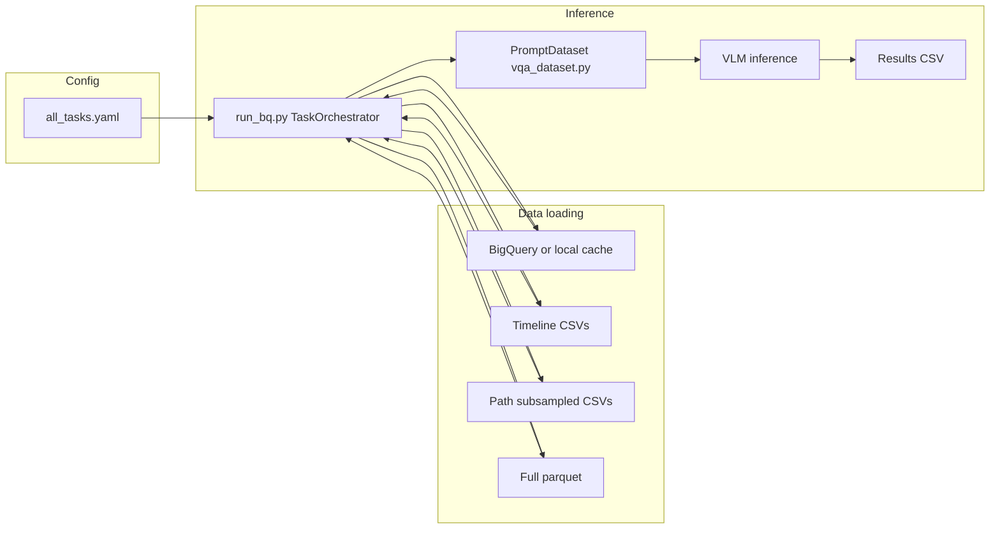

# Vista Eval VLM Pipeline Documentation

Vista Eval VLM is an evaluation pipeline for vision-language models (VLMs) on the Vista Bench benchmark. It supports multiple modalities (patient timeline text, CT scans, pathology slides) and experiment types (text-only, image-only, combined) across tasks defined in Vista Bench.

## High-level pipeline

Flow: **Config** (`all_tasks.yaml`) drives **task and experiment selection**. For each task, the orchestrator **loads data** (from BigQuery or local cache, merged with timeline CSVs, path CSVs, or full parquet as needed). It builds a `PromptDataset` (from `vqa_dataset.py`), runs **model inference**, and writes **results CSVs** per task, experiment, and model.

## Documentation index

| Doc | Description |
|-----|--------------|
| [01-pathology-and-path-tools.md](01-pathology-and-path-tools.md) | How to obtain and use pathology (WSI) data: subsample → download → tile → `path_tile_base`/`test_patch`; config; how `run_bq` and `vqa_dataset` use path data. |
| [02-ct-scans.md](02-ct-scans.md) | NIfTI source (BigQuery/bucket), `download_subsampled_ct`, `ct_dir`, and how CT is loaded and sliced in `vqa_dataset`. |
| [03-vista-bench-data-cohort.md](03-vista-bench-data-cohort.md) | Where task and cohort data come from: BigQuery dataset, local cache, valid_tasks, timeline CSVs, path_subsampled, full parquet, retrieval CSVs. |
| [04-running-the-pipeline.md](04-running-the-pipeline.md) | End-to-end run: `all_tasks.yaml`, `weill.sh` / `run_bq.py`, TaskOrchestrator flow, PromptDataset, experiments and output. |
| [05-retrieval.md](05-retrieval.md) | Retrieval pipeline: downloading XMLs, meds-mcp (BM25 document store), iterative_retrieval.py, cohort CSVs, and how it all ties together. |

## Key config paths

| Key | Purpose |
|-----|---------|
| `paths.base_dir` | Vista Bench root (valid_tasks, prompts, BQ cache, timeline/path CSVs). |
| `paths.results_dir` | Where result CSVs are written (`{results_dir}/{source_csv}/{task_name}/{model_name}/`). |
| `paths.ct_dir` | Local directory for NIfTI files; if set and file exists, CT is loaded from disk instead of GCP. |
| `paths.path_tile_base` | Root containing `test_patch/` with pathology tile folders (one per slide). |
| `paths.valid_tasks` | JSON of task names and `task_source_csv`. |
| `paths.prompts` / `paths.image_prompts` | Prompt templates per task. |
| `retrieval.corpus_dir` | Directory of patient XMLs for retrieval (meds-mcp); see [05-retrieval.md](05-retrieval.md). |
| `retrieval.cache_dir` | BM25 index cache directory (meds-mcp). |
